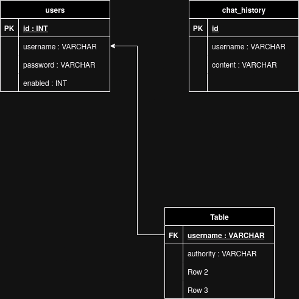
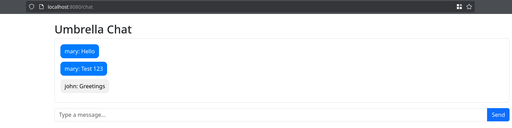

# Umbrella Chat

### This is a basic chat messaging web application made in Spring Boot. 
### UmbrellaChat leverages Hibernate, MariaDB, Spring Security (web session), bcrypt and WebSockets.
### The front end is made with Thymeleaf.

## How to run

### Make sure you use at least Java 17, satisfy the dependencies with Maven and change the database credentials in src/main/resources/application.properties. Then compile and run with maven.

## Database diagram

## Screenshots
